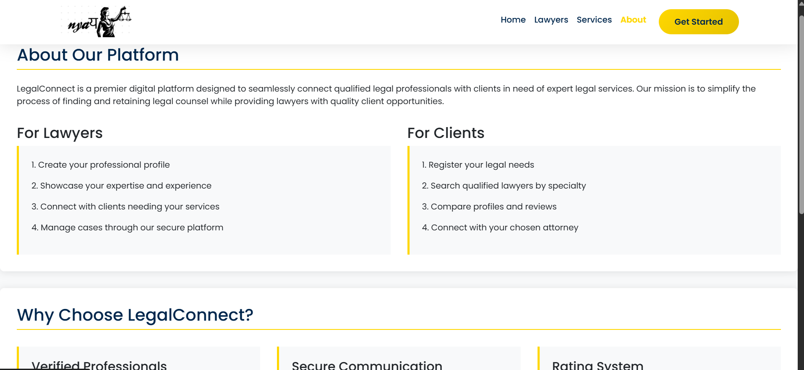
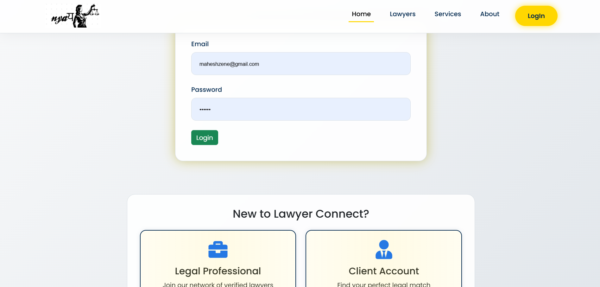
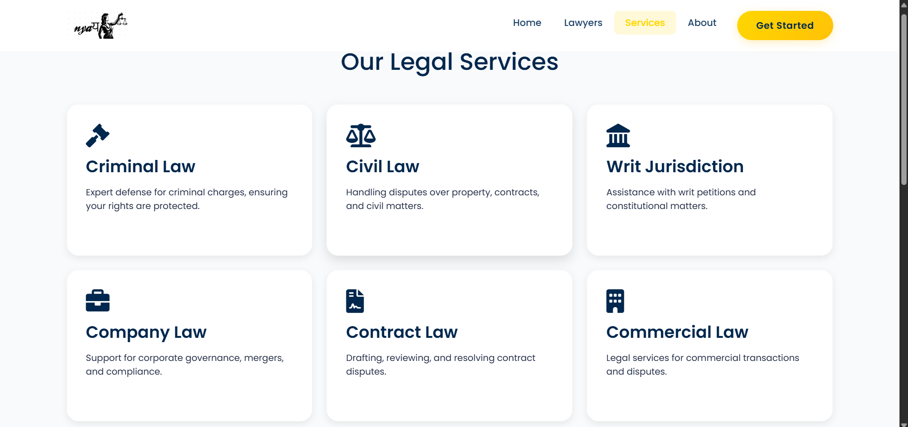

# Lawyer Management System

The Lawyer Management System is a web-based platform designed to streamline the interaction between clients, lawyers, and administrators. It allows clients to search for lawyers, book appointments, manage case details, while providing lawyers and administrators with tools to manage their operations securely and efficiently.

## 🔗 Live Demo
  [Click here to view the live website](https://naya.free.nf/)


## Features

- User-friendly interface for clients, lawyers, and admins
- Search and filter lawyers based on specialization and availability
- Appointment booking system with real-time availability
- Case management for clients and lawyers
- Admin dashboard to manage users and platform operations
- Secure login system for all user roles

## Technologies Used

- **Frontend:** HTML, CSS, JavaScript
- **Backend:** PHP
- **Database:** MySQL
- **Development Tools:** XAMPP / WAMP

## Folder Structure
```
nayyay-main/
│
├── admin/ # Admin dashboard and controls
├── lawyer/ # Lawyer dashboard and appointment manager
├── client/ # Client portal for booking and case tracking
├── includes/ # Reusable PHP files (db connection, auth)
├── assets/ # CSS, JS, and images
└── index.php # Landing page
```
## How to Run

1. Clone or download the repository.
2. Install and start a local server (XAMPP/WAMP recommended).
3. Import the database file from `/database/lawyer_db.sql` into phpMyAdmin.
4. Place the project folder in your server directory (`htdocs` for XAMPP).
5. Access the application via `http://localhost/nayyay-main`.

## Screenshots

## Screenshots

### Landing Page


### About Page


### Login Page


### Services Page



## Contributors

  
   **Mahesh Zune**  
  GitHub: [@maheshzune](https://github.com/maheshzune)  
  LinkedIn: [linkedin.com/in/Mahesh-Zune-link](https://www.linkedin.com/in/maheshzune/) 
  
   **Dhruvika Chitte**  
  GitHub: [@dhruika](https://github.com/dhruika)  
  LinkedIn: [linkedin.com/in/Dhruvika-chitte-link](https://www.linkedin.com/in/dhruvika-chitte-4b22a5330/ )


## License

This project was built for educational purposes and academic submission. All rights reserved.
